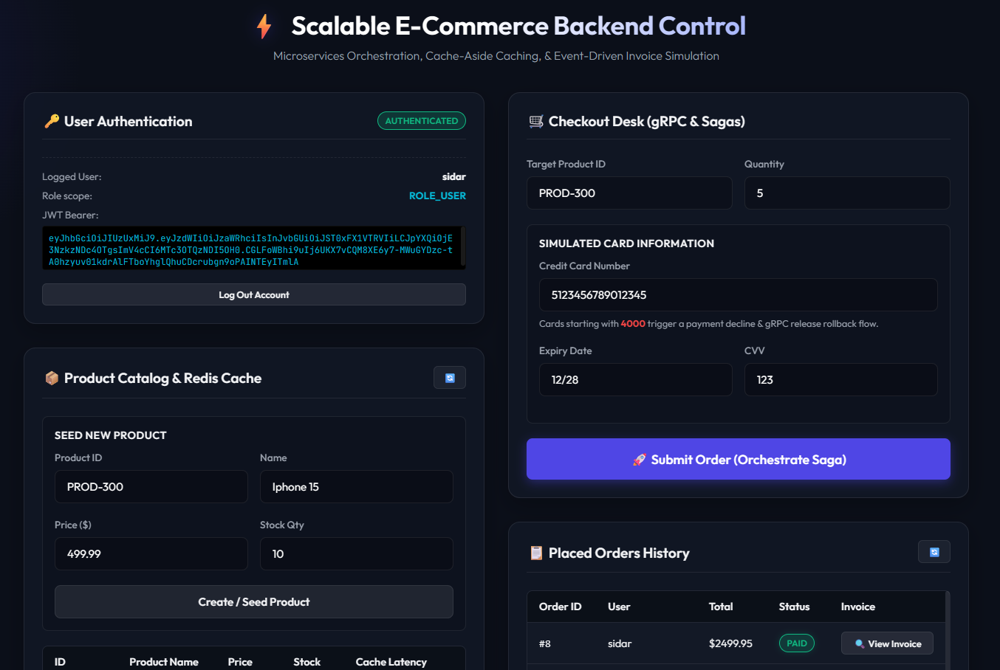
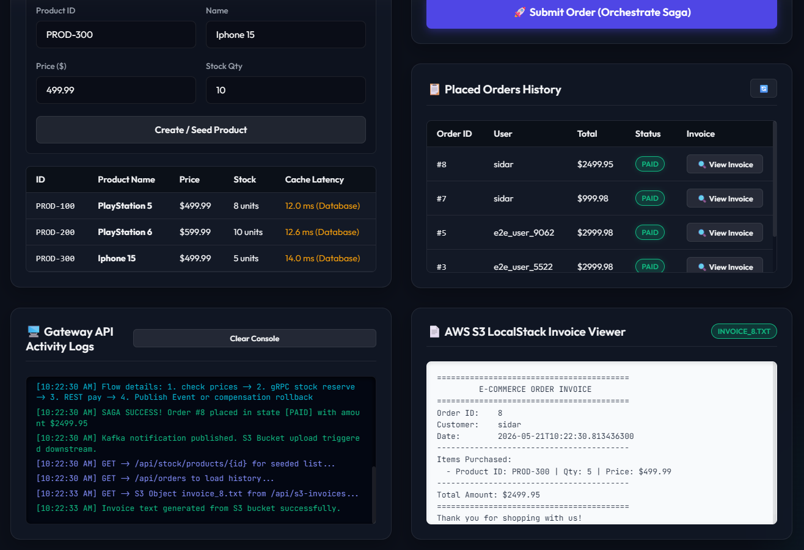
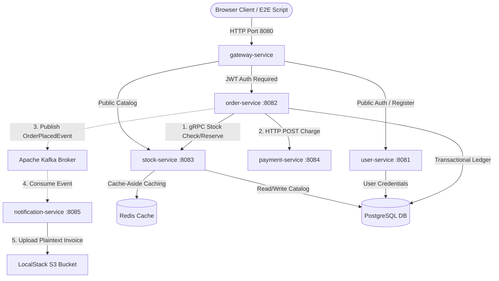

# Scalable E-Commerce Microservices Platform

[](https://spring.io/projects/spring-boot)
[](https://www.oracle.com/java/)
[](https://kafka.apache.org/)
[](https://redis.io/)
[](https://grpc.io/)
[](https://localstack.cloud/)
[](https://www.docker.com/)

A production-ready, highly-scalable, and event-driven microservices architecture simulating a high-throughput e-commerce checkout flow (inspired by Getir and Trendyol). This project demonstrates advanced backend patterns, distributed transactions, inter-service communications, caching strategies, and localized cloud emulations.

---

## 📸 Interactive Web Frontend & Screenshots

The project includes a custom-built, zero-dependency, glassmorphic dark-theme control panel for visual verification and testing of the entire flow.

### Features of the Dashboard:
- **Real-Time Log Stream**: Monitors event processing and internal service network hops.
- **Latency Monitoring**: Visualizes Cache-Aside latency comparison between cold database reads (~500ms) vs. warm Redis cache hits (~3-5ms).
- **Interactive Checkout (Saga)**: Allows triggers for both happy path (PAID) and failure paths (triggers compensation flow and restores inventory).
- **Invoice Viewer**: Downloads generated invoices directly from the LocalStack S3 emulator through a CORS-safe Node.js proxy server.

### Project Dashboard Screenshots
#### 1. Authentication, Product Catalog Seeding, and Checkout Panel


#### 2. Live Log Stream Console & S3 Invoice Download Panel


---

## 📂 Project Directory Structure

Here is a breakdown of the codebase organization:

```text
scalable-ecommerce-backend/
├── common-proto/             # Shared Protocol Buffers definitions (inventory.proto)
├── gateway-service/          # Spring Cloud Gateway (routing, global CORS, security integration)
├── user-service/             # Authentication & User Management (JWT, BCrypt)
├── stock-service/            # Catalog Inventory (gRPC server, Redis Cache-Aside, PostgreSQL)
├── order-service/            # Order Checkout Management (Saga Orchestration, gRPC client, PostgreSQL)
├── payment-service/          # Transaction Processor (Simulated credit card authentication)
├── notification-service/     # Order Event Notification (Kafka consumer, AWS S3 Invoice generation)
├── frontend/                 # Interactive Dashboard UI (HTML, CSS, JS, server-side Node.js proxy)
│   ├── assets/               # Dashboard screenshots for README.md
│   ├── app.js                # Core frontend client logic
│   ├── index.html            # Dashboard main UI page
│   ├── server.js             # Node.js server with S3 CORS proxy logic
│   └── style.css             # Glassmorphic dark design system styling
├── docker-compose.yml        # Docker config for PostgreSQL, Redis, Kafka, and LocalStack
├── run-all.ps1               # Automated Windows PowerShell startup script for all services
└── README.md                 # System Documentation & Architecture Guide
```

---

## 🏛️ System Architecture & Data Flow

The platform is structured as a 5-service architecture backed by an API gateway, utilizing relational databases, cache layers, message brokers, and object storages:



### Microservices Details:

1. **`gateway-service` (Port 8080)**: Acts as the single entry point. Configured with Spring Cloud Gateway routing rules, JWT filter parsing, and global CORS handling to safely talk to the web frontend.
2. **`user-service` (Port 8081)**: Manages registration, password hashing (BCrypt), authentication, and signs secure JWT tokens containing user roles.
3. **`stock-service` (Port 8083 / gRPC Port 9090)**: Manages catalog inventory.
   - Offers high-speed synchronous stock reservation via **gRPC** (Proto3).
   - Features a **Cache-Aside** strategy using **Redis** to cache product states, reducing database load and speeding up catalog queries.
4. **`order-service` (Port 8082)**: Coordinates checkout transactions. Orchestrates the Saga pattern, invoking stock reservations and payment verification synchronously, before firing events to the Kafka broker.
5. **`payment-service` (Port 8084)**: Simulates credit card validation. Cards starting with `4000` trigger simulated failures, forcing an immediate Saga rollback.
6. **`notification-service` (Port 8085)**: Consumes `OrderPlacedEvent` asynchronously from **Kafka**, writes formatted plaintext invoices, and uploads them to the **AWS S3 LocalStack** emulator.

---

## 🚀 Key Architectural Patterns Implemented

### 1. Distributed Transactions (Saga Orchestration & Compensation)
To maintain consistency across independent database boundaries without utilizing slow distributed locking (2PC), the checkout employs a linear **Saga Orchestrator**:
- **Happy Path**: Stock is reserved via gRPC -> Payment is captured via REST -> Order status changes to `PAID` -> Kafka dispatches order event -> S3 invoice is generated.
- **Compensation Path (Rollback)**: If payment fails, the orchestrator triggers compensation flows: the order status is updated to `CANCELLED`, and inventory is restored in the stock service.

### 2. High-Performance gRPC Communication
Inter-service communication between `order-service` and `stock-service` utilizes **gRPC**. This guarantees type-safe contracting (via Protocol Buffers), binary serialization, and HTTP/2 multiplexing, resulting in ultra-low latency compared to standard REST clients.

### 3. Redis Cache-Aside Strategy
Dynamic stock queries go through a Redis cache layer first:
- **Cache Hit**: Returns data immediately from Redis (under 5ms).
- **Cache Miss**: Queries PostgreSQL, populates Redis for future requests, and returns (around 500ms simulating cold database latency).
- **Cache Eviction**: Inventory updates (e.g. stock reservation or rollback restoration) automatically invalidate relevant keys to prevent dirty reads.

---

## 🛠️ Quick Start Guide

### Prerequisites
Make sure you have the following installed on your machine:
- **Java 17 JDK**
- **Docker Desktop**
- **Node.js** (for running the frontend control panel server)
- **PowerShell** (for executing Windows helper startup scripts)

### Installation & Startup

1. **Clone the Repository:**
   ```bash
   git clone https://github.com/SidarOrmanJ/Scalable-E-Commerce.git
   cd Scalable-E-Commerce
   ```

2. **Launch Infrastructure & Services:**
   We provide a fully-automated startup script `run-all.ps1` which starts the backing services in Docker Compose (PostgreSQL, Kafka, Redis, LocalStack) and spins up all 6 backend services and the frontend Node.js server in separate, named terminal windows.
   ```powershell
   .\run-all.ps1
   ```

3. **Verify the Services are Running:**
   - Gateway API: `http://localhost:8080`
   - Frontend Control Panel: `http://localhost:3000`
   - LocalStack Dashboard: `http://localhost:4566`
   - Swagger Documentation:
     - User Service: `http://localhost:8081/swagger-ui.html`
     - Stock Service: `http://localhost:8083/swagger-ui.html`
     - Order Service: `http://localhost:8082/swagger-ui.html`

---

## 🧪 Testing and Verification

### Automated E2E Test Suite
The project contains an automated end-to-end integration test script that performs:
1. User registration & login (JWT generation)
2. Catalog product seeding
3. Latency comparisons (Redis cache hit/miss checks)
4. SAGA Happy Path Checkout (invoking gRPC stock reservation, HTTP payments, Kafka event generation, and LocalStack S3 invoice verification)
5. SAGA Rollback Execution (forcing payment failures and validating inventory restoration)

To run the E2E verification test:
```powershell
powershell -ExecutionPolicy Bypass -File "C:/Users/ADMIN/.gemini/antigravity-ide/brain/fa5cd859-72a3-44dd-8b27-3e3f3dbf4486/scratch/test-e2e.ps1"
```
*(Make sure to adjust the test script path to point to your local test suite if running outside workspace directories)*

---

## 🛠️ Technical Stack & Dependencies

- **Framework**: Spring Boot 3.2.x, Spring Cloud Gateway
- **Build Tool**: Gradle Multi-Module Build
- **Databases**: PostgreSQL (Relational Storage), Redis (Caching)
- **Messaging**: Apache Kafka (Event-Driven Broker)
- **Cloud Emulation**: LocalStack (AWS S3)
- **RPC & Protocols**: gRPC, Protocol Buffers v3, JSON
- **Security**: Spring Security 6.x, JSON Web Token (JWT)
- **Documentation**: Springdoc OpenAPI v2 (Swagger)
- **Frontend**: Vanilla HTML5, Custom Glassmorphic CSS, Vanilla JavaScript, Node.js (Proxy Server)
